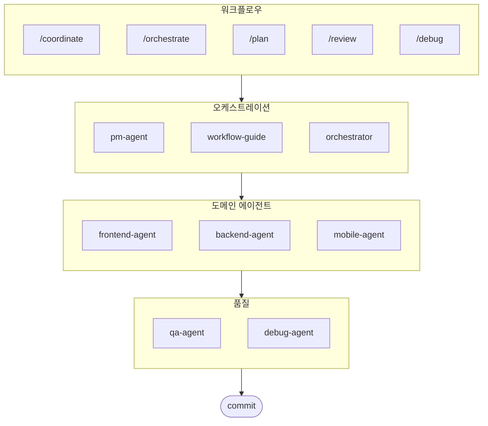

# oh-my-ag: Antigravity를 위한 멀티 에이전트 오케스트레이터

Google Antigravity를 위한 궁극의 멀티 에이전트 프레임워크.

**Serena Memory**를 통해 6개의 전문 도메인 에이전트(PM, Frontend, Backend, Mobile, QA, Debug)를 조율하세요. 병렬 CLI 실행, 실시간 관측 대시보드, 제로 설정(zero-config) 방식의 점진적 스킬 로딩을 지원합니다. 에이전트 기반 코딩을 위해 모든 것이 준비된 올인원 솔루션입니다.

> **마음에 드셨나요?** 스타 눌러주세요!
>
> ```bash
> gh api --method PUT /user/starred/first-fluke/oh-my-ag
> ```
>
> **풀스택 개발이 처음이신가요?** 최적화된 스타터 템플릿으로 시작필보세요:
>
> ```bash
> git clone https://github.com/first-fluke/fullstack-starter
> ```
>
> 이 스킬들이 미리 설정되어 있어 바로 멀티 에이전트 협업이 가능합니다.

## 목차

- [아키텍처](#아키텍처)
- [이게 뭔가요?](#이게-뭔가요)
- [빠른 시작](#빠른-시작)
- [동작 원리](#동작-원리)
- [실시간 대시보드](#실시간-대시보드)
- [스킬 아키텍처](#스킬-아키텍처)
- [CLI 명령어](#cli-명령어)
- [후원하기](#후원하기)
- [라이선스](#라이선스)

## 이게 뭔가요?

멀티 에이전트 협업 개발을 위한 **Antigravity Skills** 모음입니다. 작업을 전문 에이전트에게 분배합니다:

| 에이전트 | 전문 분야 | 발동 키워드 |
|---------|----------|-----------|
| **Workflow Guide** | 복잡한 멀티 에이전트 프로젝트 조율 | "멀티 도메인", "복잡한 프로젝트" |
| **PM Agent** | 요구사항 분석, 태스크 분해, 아키텍처 설계 | "기획", "분석", "뭘 만들어야 할까" |
| **Frontend Agent** | React/Next.js, TypeScript, Tailwind CSS | "UI", "컴포넌트", "스타일링" |
| **Backend Agent** | FastAPI, PostgreSQL, JWT 인증 | "API", "데이터베이스", "인증" |
| **Mobile Agent** | Flutter 크로스 플랫폼 개발 | "모바일 앱", "iOS/Android" |
| **QA Agent** | OWASP Top 10 보안, 성능, 접근성 감사 | "보안 검토", "감사", "성능 확인" |
| **Debug Agent** | 버그 진단, 근본 원인 분석, 회귀 테스트 | "버그", "에러", "크래시" |
| **Orchestrator** | CLI 기반 병렬 에이전트 실행 + Serena Memory | "에이전트 실행", "병렬 실행" |
| **Commit** | Conventional Commits 규칙 기반 커밋 관리 | "커밋", "변경사항 저장" |

## 아키텍처



## 빠른 시작

### 사전 요구 사항

- **Google Antigravity** (2026+)
- **Bun** (CLI 및 대시보드용)
- **uv** (Serena 설정용)

### 옵션 1: 대화형 CLI (권장)

```bash
# bun이 없으면 먼저 설치:
# curl -fsSL https://bun.sh/install | bash

# uv가 없으면 먼저 설치:
# curl -LsSf https://astral.sh/uv/install.sh | sh

bunx oh-my-ag
```

프로젝트 타입을 선택하면 `.agent/skills/`에 스킬이 설치됩니다.

| 프리셋 | 스킬 |
|--------|--------|
| ✨ All | 전체 |
| 🌐 Fullstack | frontend, backend, pm, qa, debug, commit |
| 🎨 Frontend | frontend, pm, qa, debug, commit |
| ⚙️ Backend | backend, pm, qa, debug, commit |
| 📱 Mobile | mobile, pm, qa, debug, commit |

### 옵션 2: 전역 설치 (Orchestrator용)

SubAgent Orchestrator를 사용하거나 도구를 전역에서 사용하려면:

```bash
bun install --global oh-my-ag
```

최소 1개의 CLI 도구가 필요합니다:

| CLI | 설치 | 인증 |
|-----|------|------|
| Gemini | `bun install --global @anthropic-ai/gemini-cli` | `gemini auth` |
| Claude | `bun install --global @anthropic-ai/claude-code` | `claude auth` |
| Codex | `bun install --global @openai/codex` | `codex auth` |
| Qwen | `bun install --global @qwen-code/qwen` | `qwen auth` |

### 옵션 3: 기존 프로젝트에 통합하기

**권장 방법 (CLI):**

기존 프로젝트의 루트 디렉토리에서 다음 명령어를 실행하면 스킬과 워크플로우가 자동으로 설치됩니다:

```bash
bunx oh-my-ag
```

> **팁:** 설치 후 `bunx oh-my-ag doctor`를 실행하여 모든 설정(전역 워크플로우 포함)이 올바른지 확인하세요.

**수동 방법 (파일 복사):**

이미 oh-my-ag 저장소를 클론했다면 파일 복사로도 가능합니다:

```bash
# 1. 스킬 복사
cp -r oh-my-ag/.agent/skills /path/to/your-project/.agent/

# 2. 워크플로우 복사
cp -r oh-my-ag/.agent/workflows /path/to/your-project/.agent/

# 3. 설정 복사 (선택)
cp -r oh-my-ag/.agent/config /path/to/your-project/.agent/
```

본인 프로젝트에서:

```bash
cd /path/to/your-project
antigravity open .
```

모든 스킬이 이제 본인 프로젝트에서 사용 가능합니다!

### 2. 초기 설정 (선택)

```
/setup
→ CLI 설치 확인, MCP 연결 상태, 언어 및 CLI 매핑 설정
```

이 명령은 `.agent/config/user-preferences.yaml`을 생성합니다.

### 3. 채팅으로 사용

**간단한 작업** (단일 에이전트 자동 활성화):

```
"Tailwind CSS로 로그인 폼 만들어줘"
→ frontend-agent 자동 활성화
```

**복잡한 프로젝트** (workflow-guide가 조율):

```
"사용자 인증이 있는 TODO 앱 만들어줘"
→ workflow-guide → PM Agent 기획 → Agent Manager에서 에이전트 생성
```

**명시적 조율** (유저가 워크플로우 호출):

```
/coordinate
→ 단계별: PM 기획 → 에이전트 생성 → QA 검토
```

**변경사항 커밋** (Conventional Commits):

```
/commit
→ 변경 분석, 커밋 타입/스코프 제안, Co-Author 포함 커밋 생성
```

### 3. 대시보드로 모니터링

대시보드 설정과 상세 사용법은 [`web/content/ko/guide/usage.md`](./web/content/ko/guide/usage.md#실시간-대시보드)를 참고하세요.

## 동작 원리

### Progressive Disclosure (점진적 공개)

스킬을 수동으로 선택할 필요 없습니다. Antigravity가 자동으로:

1. 채팅 요청을 분석
2. `.agent/skills/`의 스킬 설명과 매칭
3. 필요한 스킬만 컨텍스트에 로드
4. 지연 로딩으로 토큰 절약

### Agent Manager UI

복잡한 프로젝트에는 Antigravity **Agent Manager** (Mission Control)를 사용합니다:

1. PM Agent가 기획서 작성
2. Agent Manager UI에서 에이전트 생성
3. 에이전트들이 별도 워크스페이스에서 병렬 작업
4. 인박스 알림으로 진행 상황 확인
5. QA Agent가 최종 검토

### SubAgent Orchestrator (CLI)

프로그래밍 방식의 병렬 실행:

```bash
# 인라인 프롬프트 (workspace 자동 탐지)
oh-my-ag agent:spawn backend "인증 API 구현" session-01

# 파일에서 프롬프트 읽기
oh-my-ag agent:spawn backend .agent/tasks/backend-auth.json session-01

# 명시적 workspace 지정
oh-my-ag agent:spawn backend "인증 API 구현" session-01 -w ./apps/api

# 병렬 실행
oh-my-ag agent:spawn backend "인증 API 구현" session-01 &
oh-my-ag agent:spawn frontend "로그인 폼 생성" session-01 &
wait
```

지원 CLI: **Gemini**, **Claude**, **Codex**, **Qwen**

### 멀티-CLI 설정

`.agent/config/user-preferences.yaml`에서 에이전트별 CLI 설정:

```yaml
# 응답 언어
language: ko  # ko, en, ja, zh, ...

# 기본 CLI (단일 작업)
default_cli: gemini

# 에이전트별 CLI 매핑 (멀티-CLI 모드)
agent_cli_mapping:
  frontend: gemini
  backend: codex
  mobile: gemini
  pm: claude
  qa: claude
  debug: gemini
```

**CLI 우선순위**:

1. `--vendor` 명령줄 인자
2. `user-preferences.yaml`의 `agent_cli_mapping`
3. `user-preferences.yaml`의 `default_cli`
4. `cli-config.yaml`의 `active_vendor` (레거시)
5. 하드코딩 기본값: `gemini`

대화형으로 설정하려면 `/setup` 실행.

### Serena Memory 조율

Orchestrator가 `.serena/memories/`에 구조화된 상태를 기록합니다:

| 파일 | 용도 |
|------|------|
| `orchestrator-session.md` | 세션 ID, 상태, 단계 |
| `task-board.md` | 에이전트 할당 및 상태 테이블 |
| `progress-{agent}.md` | 에이전트별 턴 단위 진행 상황 |
| `result-{agent}.md` | 에이전트별 완료 결과 |

두 대시보드 모두 이 파일들을 감시하여 실시간 모니터링합니다.

## 실시간 대시보드

대시보드는 orchestrator 세션 모니터링을 위한 선택 기능입니다.

- 터미널: `bunx oh-my-ag dashboard`
- 웹: `bunx oh-my-ag dashboard:web` (`http://localhost:9847`)

요구사항, 화면, 상세 동작은 [`web/content/ko/guide/usage.md`](./web/content/ko/guide/usage.md#실시간-대시보드)를 참고하세요.

## 스킬 아키텍처

각 스킬은 **토큰 최적화된 2계층 설계**를 사용합니다:

- **SKILL.md** (~40줄): Antigravity가 즉시 로드. 스킬 정체성, 라우팅 조건, 핵심 규칙만 포함.
- **resources/**: 필요 시 로드. 실행 프로토콜, few-shot 예시, 체크리스트, 에러 플레이북, 코드 스니펫, 기술 스택 상세 포함.

이를 통해 초기 스킬 로딩 시 **~75% 토큰 절약** (스킬당 3-7KB → ~800B).

### 공통 리소스 (`_shared/`)

모든 스킬에서 중복 제거된 공통 리소스:

| 리소스 | 용도 |
|--------|------|
| `reasoning-templates.md` | 다단계 추론을 위한 구조화된 빈칸 채우기 템플릿 |
| `clarification-protocol.md` | 질문 vs 가정 판단, 모호성 수준별 대응 |
| `context-budget.md` | 모델 등급별 토큰 효율적 파일 읽기 전략 |
| `context-loading.md` | Orchestrator 프롬프트 구성을 위한 태스크-리소스 매핑 |
| `skill-routing.md` | 키워드→스킬 매핑, 병렬 실행 규칙 |
| `difficulty-guide.md` | Simple/Medium/Complex 평가 및 프로토콜 분기 |
| `lessons-learned.md` | 크로스 세션 누적 도메인 교훈 |
| `verify.sh` | 에이전트 완료 후 자동 검증 스크립트 |
| `api-contracts/` | PM이 작성, Backend가 구현, Frontend/Mobile이 소비 |
| `serena-memory-protocol.md` | CLI 모드 메모리 읽기/쓰기 프로토콜 |
| `common-checklist.md` | 범용 코드 품질 체크리스트 |

### 스킬별 리소스

각 스킬이 도메인 특화 리소스를 제공:

| 리소스 | 용도 |
|--------|------|
| `execution-protocol.md` | 4단계 Chain-of-thought 워크플로우 (분석 → 설계 → 구현 → 검증) |
| `examples.md` | 2-3개 few-shot 입출력 예시 |
| `checklist.md` | 도메인별 셀프 검증 체크리스트 |
| `error-playbook.md` | "3 strikes" 에스컬레이션 규칙을 포함한 장애 복구 |
| `tech-stack.md` | 상세 기술 사양 |
| `snippets.md` | 바로 사용 가능한 코드 패턴 |

## CLI 명령어

```bash
bunx oh-my-ag                # 대화형 스킬 설치
bunx oh-my-ag bridge         # MCP stdio - SSE 브릿지 (Serena용)
bunx oh-my-ag dashboard      # 터미널 실시간 대시보드
bunx oh-my-ag dashboard:web  # 웹 대시보드 (http://localhost:9847)
bunx oh-my-ag doctor         # 설정 확인 & 누락된 스킬 보강
bunx oh-my-ag help           # 도움말 표시
bunx oh-my-ag memory:init    # Serena 메모리 스키마 초기화
bunx oh-my-ag retro          # 세션 회고 (배운 점 & 다음 단계)
bunx oh-my-ag stats          # 생산성 메트릭 조회
bunx oh-my-ag update         # 스킬을 최신 버전으로 업데이트
bunx oh-my-ag usage          # 모델 사용량 쿼터 조회
```

문제 해결과 멀티-레포 중앙 레지스트리 문서는 웹 가이드로 이동했습니다:

- 사용 가이드 (EN): [`web/content/en/guide/usage.md`](./web/content/en/guide/usage.md)
- 사용 가이드 (KO): [`web/content/ko/guide/usage.md`](./web/content/ko/guide/usage.md)
- 중앙 레지스트리 (EN): [`web/content/en/guide/central-registry.md`](./web/content/en/guide/central-registry.md)
- 중앙 레지스트리 (KO): [`web/content/ko/guide/central-registry.md`](./web/content/ko/guide/central-registry.md)

## 후원하기

이 프로젝트는 후원자분들의 지원으로 유지됩니다.

<a href="https://github.com/sponsors/first-fluke">
  
</a>
<a href="https://buymeacoffee.com/firstfluke">
  
</a>

### 🚀 Champion

<!-- Champion 티어 ($100/월) 로고 -->

### 🛸 Booster

<!-- Booster 티어 ($30/월) 로고 -->

### ☕ Contributor

<!-- Contributor 티어 ($10/월) 이름 -->

[후원자 되기 →](https://github.com/sponsors/first-fluke)

전체 후원자 목록은 [SPONSORS.md](./SPONSORS.md)를 참고하세요.

## 스타 히스토리

[](https://www.star-history.com/#first-fluke/oh-my-ag&type=date&legend=bottom-right)

## 라이선스

MIT

---
**Google Antigravity 2026용** | **통합 가이드:** [EN](./web/content/en/guide/integration.md) · [KO](./web/content/ko/guide/integration.md)
