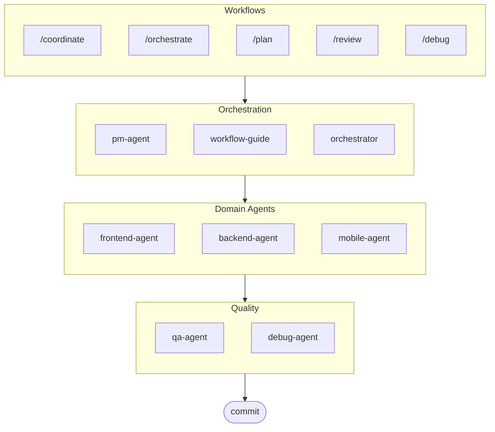

# oh-my-ag: Multi-Agent Orchestrator for Antigravity

[한국어](./README.ko.md)

The Ultimate Multi-Agent Framework for Google Antigravity.

Orchestrate 6 specialized domain agents (PM, Frontend, Backend, Mobile, QA, Debug) via **Serena Memory**. Features parallel CLI execution, real-time observability dashboards, and zero-config progressive skill loading. The batteries-included solution for agentic coding.

> **Like this project?** Give it a star!
>
> ```bash
> gh api --method PUT /user/starred/first-fluke/oh-my-ag
> ```
>
> **New to fullstack development?** Try our optimized starter template:
>
> ```bash
> git clone https://github.com/first-fluke/fullstack-starter
> ```
>
> Pre-configured with these skills for instant multi-agent collaboration.

## Table of Contents

- [Architecture](#architecture)
- [What Is This?](#what-is-this)
- [Quick Start](#quick-start)
- [How It Works](#how-it-works)
- [Real-time Dashboards](#real-time-dashboards)
- [Skill Architecture](#skill-architecture)
- [CLI Commands](#cli-commands)
- [Troubleshooting](#troubleshooting)
- [Central Registry](#central-registry-for-multi-repo-setup)
- [Sponsors](#sponsors)
- [License](#license)

## Architecture



## What Is This?

A collection of **Antigravity Skills** enabling collaborative multi-agent development. Work is distributed across expert agents:

| Agent | Specialization | Triggers |
|-------|---------------|----------|
| **Workflow Guide** | Coordinates complex multi-agent projects | "multi-domain", "complex project" |
| **PM Agent** | Requirements analysis, task decomposition, architecture | "plan", "break down", "what should we build" |
| **Frontend Agent** | React/Next.js, TypeScript, Tailwind CSS | "UI", "component", "styling" |
| **Backend Agent** | FastAPI, PostgreSQL, JWT authentication | "API", "database", "authentication" |
| **Mobile Agent** | Flutter cross-platform development | "mobile app", "iOS/Android" |
| **QA Agent** | OWASP Top 10 security, performance, accessibility | "review security", "audit", "check performance" |
| **Debug Agent** | Bug diagnosis, root cause analysis, regression tests | "bug", "error", "crash" |
| **Orchestrator** | CLI-based parallel agent execution with Serena Memory | "spawn agent", "parallel execution" |
| **Commit** | Conventional Commits with project-specific rules | "commit", "save changes" |

## Quick Start

### Prerequisites

- **Google Antigravity** (2026+)
- **Bun** (for CLI and dashboards)
- **uv** (for Serena setup)

### Option 1: Interactive CLI (Recommended)

```bash
# Install bun if you don't have it:
# curl -fsSL https://bun.sh/install | bash

# Install uv if you don't have it:
# curl -LsSf https://astral.sh/uv/install.sh | sh

bunx oh-my-ag
```

Select your project type and skills will be installed to `.agent/skills/`.

| Preset | Skills |
|--------|--------|
| ✨ All | Everything |
| 🌐 Fullstack | frontend, backend, pm, qa, debug, commit |
| 🎨 Frontend | frontend, pm, qa, debug, commit |
| ⚙️ Backend | backend, pm, qa, debug, commit |
| 📱 Mobile | mobile, pm, qa, debug, commit |

### Option 2: Global Installation (For Orchestrator)

To use the core tools globally or run the SubAgent Orchestrator:

```bash
bun install --global oh-my-ag
```

You'll also need at least one CLI tool:

| CLI | Install | Auth |
|-----|---------|------|
| Gemini | `bun install --global @anthropic-ai/gemini-cli` | `gemini auth` |
| Claude | `bun install --global @anthropic-ai/claude-code` | `claude auth` |
| Codex | `bun install --global @openai/codex` | `codex auth` |
| Qwen | `bun install --global @qwen-code/qwen` | `qwen auth` |

### Option 3: Integrate into Existing Project

**Recommended (CLI):**

Run the following command in your project root to automatically install/update skills and workflows:

```bash
bunx oh-my-ag
```

> **Tip:** Run `bunx oh-my-ag doctor` after installation to verify everything is set up correctly (including global workflows).

**Manual Method:**

If you have cloned this repo, you can simply copy the `.agent` directory:

```bash
# 1. Copy skills
cp -r oh-my-ag/.agent/skills /path/to/your-project/.agent/

# 2. Copy workflows
cp -r oh-my-ag/.agent/workflows /path/to/your-project/.agent/

# 3. Copy config (optional)
cp -r oh-my-ag/.agent/config /path/to/your-project/.agent/
```

### 2. Initial Setup (Optional)

```
/setup
→ Check CLI installations, MCP connections, configure language & CLI mapping
```

This creates `.agent/config/user-preferences.yaml` for your project.

### 3. Chat

**Simple task** (single agent auto-activates):

```
"Create a login form with Tailwind CSS and form validation"
→ frontend-agent activates
```

**Complex project** (workflow-guide coordinates):

```
"Build a TODO app with user authentication"
→ workflow-guide → PM Agent plans → agents spawned in Agent Manager
```

**Explicit coordination** (user-triggered workflow):

```
/coordinate
→ Step-by-step: PM planning → agent spawning → QA review
```

**Commit changes** (conventional commits):

```
/commit
→ Analyze changes, suggest commit type/scope, create commit with Co-Author
```

### 3. Monitor with Dashboards

For dashboard setup and usage details, see [`web/content/en/guide/usage.md`](./web/content/en/guide/usage.md#real-time-dashboards).

## How It Works

### Progressive Disclosure

You don't manually select skills. Antigravity automatically:

1. Scans your chat request
2. Matches against skill descriptions in `.agent/skills/`
3. Loads the relevant skill only when needed
4. Saves tokens via lazy loading

### Agent Manager UI

For complex projects, use Antigravity's **Agent Manager** (Mission Control):

1. PM Agent creates a plan
2. You spawn agents in the Agent Manager UI
3. Agents work in parallel with separate workspaces
4. Monitor progress via inbox notifications
5. QA Agent reviews the final output

### SubAgent Orchestrator (CLI)

For programmatic parallel execution:

```bash
# Inline prompt (workspace auto-detected)
oh-my-ag agent:spawn backend "Implement auth API" session-01

# Prompt from file
oh-my-ag agent:spawn backend .agent/tasks/backend-auth.json session-01

# With explicit workspace
oh-my-ag agent:spawn backend "Implement auth API" session-01 -w ./apps/api

# Parallel agents
oh-my-ag agent:spawn backend "Implement auth API" session-01 &
oh-my-ag agent:spawn frontend "Create login form" session-01 &
wait
```

Supports multiple CLI vendors: **Gemini**, **Claude**, **Codex**, **Qwen**

### Multi-CLI Configuration

Configure different CLIs per agent type in `.agent/config/user-preferences.yaml`:

```yaml
# Response language
language: ko  # ko, en, ja, zh, ...

# Default CLI (single tasks)
default_cli: gemini

# Per-agent CLI mapping (multi-CLI mode)
agent_cli_mapping:
  frontend: gemini
  backend: codex
  mobile: gemini
  pm: claude
  qa: claude
  debug: gemini
```

**CLI Resolution Priority**:

1. `--vendor` command line argument
2. `agent_cli_mapping` from user-preferences.yaml
3. `default_cli` from user-preferences.yaml
4. `active_vendor` from cli-config.yaml (legacy)
5. Hardcoded fallback: `gemini`

Run `/setup` to configure interactively.

### Serena Memory Coordination

The Orchestrator writes structured state to `.serena/memories/`:

| File | Purpose |
|------|---------|
| `orchestrator-session.md` | Session ID, status, phase |
| `task-board.md` | Agent assignments and status table |
| `progress-{agent}.md` | Per-agent turn-by-turn progress |
| `result-{agent}.md` | Completion results per agent |

Both dashboards watch these files for real-time monitoring.

## Real-time Dashboards

Dashboards are optional monitoring tools for orchestrator sessions:

- Terminal: `bunx oh-my-ag dashboard`
- Web: `bunx oh-my-ag dashboard:web` (`http://localhost:9847`)

For requirements, screenshots, and detailed behavior, see [`web/content/en/guide/usage.md`](./web/content/en/guide/usage.md#real-time-dashboards).

## Skill Architecture

Each skill uses a **token-optimized two-layer design**:

- **SKILL.md** (~40 lines): Loaded immediately by Antigravity. Contains only identity, routing conditions, and core rules.
- **resources/**: Loaded on-demand. Contains execution protocols, few-shot examples, checklists, error playbooks, code snippets, and tech stack details.

This achieves **~75% token savings** on initial skill loading (3-7KB → ~800B per skill).

### Shared Resources (`_shared/`)

Common resources deduplicated across all skills:

| Resource | Purpose |
|----------|---------|
| `reasoning-templates.md` | Structured fill-in-the-blank templates for multi-step reasoning |
| `clarification-protocol.md` | When to ask vs. assume, ambiguity levels |
| `context-budget.md` | Token-efficient file reading strategies per model tier |
| `context-loading.md` | Task-type to resource mapping for orchestrator prompt construction |
| `skill-routing.md` | Keyword-to-skill mapping and parallel execution rules |
| `difficulty-guide.md` | Simple/Medium/Complex assessment with protocol branching |
| `lessons-learned.md` | Cross-session accumulated domain gotchas |
| `verify.sh` | Automated verification script run after agent completion |
| `api-contracts/` | PM creates contracts, backend implements, frontend/mobile consumes |
| `serena-memory-protocol.md` | CLI mode memory read/write protocol |
| `common-checklist.md` | Universal code quality checks |

### Per-Skill Resources

Each skill provides domain-specific resources:

| Resource | Purpose |
|----------|---------|
| `execution-protocol.md` | 4-step chain-of-thought workflow (Analyze → Plan → Implement → Verify) |
| `examples.md` | 2-3 few-shot input/output examples |
| `checklist.md` | Domain-specific self-verification checklist |
| `error-playbook.md` | Failure recovery with "3 strikes" escalation rule |
| `tech-stack.md` | Detailed technology specifications |
| `snippets.md` | Copy-paste ready code patterns |

## CLI Commands

```bash
bunx oh-my-ag                # Interactive skill installer
bunx oh-my-ag bridge         # Bridge MCP stdio to SSE (for Serena)
bunx oh-my-ag dashboard      # Terminal real-time dashboard
bunx oh-my-ag dashboard:web  # Web dashboard (http://localhost:9847)
bunx oh-my-ag doctor         # Check setup & repair missing skills
bunx oh-my-ag help           # Show help
bunx oh-my-ag memory:init    # Initialize Serena memory schema
bunx oh-my-ag retro          # Session retrospective (learnings & next steps)
bunx oh-my-ag stats          # View productivity metrics
bunx oh-my-ag update         # Update skills to latest version
bunx oh-my-ag usage          # Show model usage quotas
```

## Troubleshooting

### Dashboard shows "No agents detected"

Memory files haven't been created yet. Run the orchestrator or manually create files in `.serena/memories/`.

### Skills not loading in Antigravity

1. Open project with `antigravity open .`
2. Verify `.agent/skills/` folder and `SKILL.md` files exist
3. Restart Antigravity IDE

### Agents producing incompatible code

1. Review outputs in `.gemini/antigravity/brain/`
2. Re-spawn one agent referencing the other's output
3. Use QA Agent for final consistency check

## Central Registry (For Multi-Repo Setup)

This repository can serve as a **central registry** for agent skills, enabling multiple consumer projects to stay in sync with version-controlled updates.

### Architecture

```
┌─────────────────────────────────────────────────────────┐
│  Central Registry (this repo)                           │
│  • release-please for automatic versioning              │
│  • CHANGELOG.md auto-generation                         │
│  • prompt-manifest.json (version/files/checksums)       │
│  • agent-skills.tar.gz release artifact                 │
└─────────────────────────────────────────────────────────┘
                          │
                          ▼
┌─────────────────────────────────────────────────────────┐
│  Consumer Repo                                          │
│  • .agent-registry.yaml for version pinning             │
│  • New version detection → PR (no auto-merge)           │
│  • Reusable Action for file sync                        │
└─────────────────────────────────────────────────────────┘
```

### For Registry Maintainers

Releases are automated via [release-please](https://github.com/googleapis/release-please):

1. **Conventional Commits**: Use `feat:`, `fix:`, `chore:`, etc. prefixes
2. **Release PR**: Automatically created/updated on push to `main`
3. **Release**: Merge the Release PR to create a GitHub Release with:
   - `CHANGELOG.md` (auto-generated)
   - `prompt-manifest.json` (file list + SHA256 checksums)
   - `agent-skills.tar.gz` (compressed `.agent/` directory)

### For Consumer Projects

1. **Copy templates** from `docs/consumer-templates/` to your project:

   ```bash
   # Configuration file
   cp docs/consumer-templates/.agent-registry.yaml /path/to/your-project/

   # GitHub workflows
   cp docs/consumer-templates/check-registry-updates.yml /path/to/your-project/.github/workflows/
   cp docs/consumer-templates/sync-agent-registry.yml /path/to/your-project/.github/workflows/
   ```

2. **Edit `.agent-registry.yaml`** to pin your desired version:

   ```yaml
   registry:
     repo: first-fluke/oh-my-ag
     version: "1.2.0"  # Pin to specific version
   ```

3. **Workflows**:
   - `check-registry-updates.yml`: Weekly check for new versions → creates PR
   - `sync-agent-registry.yml`: Syncs `.agent/` when version changes

**Important**: Auto-merge is disabled by design. All version updates require manual review.

### Using the Reusable Action

Consumer projects can use the sync action directly:

```yaml
- uses: first-fluke/oh-my-ag/.github/actions/sync-agent-registry@main
  with:
    registry-repo: first-fluke/oh-my-ag
    version: '1.2.0'  # or 'latest'
    github-token: ${{ secrets.GITHUB_TOKEN }}
```

## Sponsors

This project is maintained thanks to our generous sponsors.

<a href="https://github.com/sponsors/first-fluke">
  
</a>
<a href="https://buymeacoffee.com/firstfluke">
  
</a>

### 🚀 Champion

<!-- Champion tier ($100/mo) logos here -->

### 🛸 Booster

<!-- Booster tier ($30/mo) logos here -->

### ☕ Contributor

<!-- Contributor tier ($10/mo) names here -->

[Become a sponsor →](https://github.com/sponsors/first-fluke)

See [SPONSORS.md](./SPONSORS.md) for a full list of supporters.

## Star History

[](https://www.star-history.com/#first-fluke/oh-my-ag&type=date&legend=bottom-right)

## License

MIT

---
**Built for Google Antigravity 2026** | **Integration guide:** [EN](./web/content/en/guide/integration.md) · [KO](./web/content/ko/guide/integration.md)
