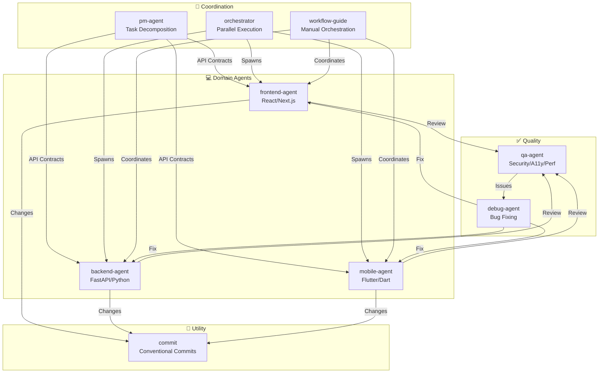

# 🛸 Antigravity Multi-Agent Skills

[한국어](./README.ko.md)

Professional agent skills for Google Antigravity IDE featuring specialized PM, Frontend, Backend, Mobile, QA, and Debug agents — coordinated through Antigravity's Agent Manager, CLI-based SubAgent Orchestrator, and real-time Serena Memory dashboards.

> **Like this project?** Give it a star!
>
> ```bash
> gh api --method PUT /user/starred/first-fluke/oh-my-ag
> ```
>
> **New to fullstack development?** Try our optimized starter template:
>
> ```bash
> git clone https://github.com/first-fluke/fullstack-starter
> ```
>
> Pre-configured with these skills for instant multi-agent collaboration.

## Table of Contents

- [Architecture](#architecture)
- [What Is This?](#what-is-this)
- [Quick Start](#quick-start)
- [How It Works](#how-it-works)
- [Real-time Dashboards](#real-time-dashboards)
- [Project Structure](#project-structure)
- [Skill Architecture](#skill-architecture)
- [Skills Overview](#skills-overview)

- [CLI Commands](#cli-commands)
- [Troubleshooting](#troubleshooting)
- [Central Registry](#central-registry-for-multi-repo-setup)
- [License](#license)

## Architecture



## What Is This?

A collection of **Antigravity Skills** enabling collaborative multi-agent development. Work is distributed across expert agents:

| Agent | Specialization |
|-------|---------------|
| **Workflow Guide** | Coordinates complex multi-agent projects |
| **PM Agent** | Requirements analysis, task decomposition, architecture |
| **Frontend Agent** | React/Next.js, TypeScript, Tailwind CSS |
| **Backend Agent** | FastAPI, PostgreSQL, JWT authentication |
| **Mobile Agent** | Flutter cross-platform development |
| **QA Agent** | OWASP Top 10 security, performance, accessibility |
| **Debug Agent** | Bug diagnosis, root cause analysis, regression tests |
| **Orchestrator** | CLI-based parallel agent execution with Serena Memory |
| **Commit** | Conventional Commits with project-specific rules |

## Quick Start

### Prerequisites

- **Google Antigravity** (2026+)
- **Bun** (for CLI and dashboards)

### Option 1: Interactive CLI (Recommended)

```bash
# Install bun if you don't have it:
# curl -fsSL https://bun.sh/install | bash

bunx oh-my-ag
```

Select your project type and skills will be installed to `.agent/skills/`.

| Preset | Skills |
|--------|--------|
| ✨ All | Everything |
| 🌐 Fullstack | frontend, backend, pm, qa, debug, commit |
| 🎨 Frontend | frontend, pm, qa, debug, commit |
| ⚙️ Backend | backend, pm, qa, debug, commit |
| 📱 Mobile | mobile, pm, qa, debug, commit |

### Option 2: Global Installation (For Orchestrator)

To use the core tools globally or run the SubAgent Orchestrator:

```bash
bun install --global oh-my-ag
```

You'll also need at least one CLI tool:

| CLI | Install | Auth |
|-----|---------|------|
| Gemini | `bun install --global @anthropic-ai/gemini-cli` | `gemini auth` |
| Claude | `bun install --global @anthropic-ai/claude-code` | `claude auth` |
| Codex | `bun install --global @openai/codex` | `codex auth` |
| Qwen | `bun install --global @qwen-code/qwen` | `qwen auth` |

### Option 3: Using vercel-labs/skills

```bash
bunx skills add first-fluke/oh-my-ag
```

### Option 4: Clone & Open

```bash
git clone https://github.com/first-fluke/oh-my-ag
cd oh-my-ag
antigravity open .
```

Antigravity automatically detects skills in `.agent/skills/`.

### Option 5: Integrate into Existing Project

**Recommended (CLI):**

Run the following command in your project root to automatically install/update skills and workflows:

```bash
bunx oh-my-ag
```

> **Tip:** Run `bunx oh-my-ag doctor` after installation to verify everything is set up correctly (including global workflows).

**Manual Method:**

If you have cloned this repo, you can simply copy the `.agent` directory:

```bash
# 1. Copy skills
cp -r oh-my-ag/.agent/skills /path/to/your-project/.agent/

# 2. Copy workflows
cp -r oh-my-ag/.agent/workflows /path/to/your-project/.agent/

# 3. Copy config (optional)
cp -r oh-my-ag/.agent/config /path/to/your-project/.agent/
```

### 2. Initial Setup (Optional)

```
/setup
→ Check CLI installations, MCP connections, configure language & CLI mapping
```

This creates `.agent/config/user-preferences.yaml` for your project.

### 3. Chat

**Simple task** (single agent auto-activates):

```
"Create a login form with Tailwind CSS and form validation"
→ frontend-agent activates
```

**Complex project** (workflow-guide coordinates):

```
"Build a TODO app with user authentication"
→ workflow-guide → PM Agent plans → agents spawned in Agent Manager
```

**Explicit coordination** (user-triggered workflow):

```
/coordinate
→ Step-by-step: PM planning → agent spawning → QA review
```

**Commit changes** (conventional commits):

```
/commit
→ Analyze changes, suggest commit type/scope, create commit with Co-Author
```

### 3. Monitor with Dashboards

```bash
bunx oh-my-ag dashboard      # Terminal dashboard (bash)
bunx oh-my-ag dashboard:web  # Web dashboard (Node.js)
# → http://localhost:9847
```

## How It Works

### Progressive Disclosure

You don't manually select skills. Antigravity automatically:

1. Scans your chat request
2. Matches against skill descriptions in `.agent/skills/`
3. Loads the relevant skill only when needed
4. Saves tokens via lazy loading

### Agent Manager UI

For complex projects, use Antigravity's **Agent Manager** (Mission Control):

1. PM Agent creates a plan
2. You spawn agents in the Agent Manager UI
3. Agents work in parallel with separate workspaces
4. Monitor progress via inbox notifications
5. QA Agent reviews the final output

### SubAgent Orchestrator (CLI)

For programmatic parallel execution:

```bash
# Single agent
oh-my-ag agent:spawn backend "Implement auth API" session-01 ./backend

# Parallel agents via orchestrator skill
oh-my-ag agent:spawn backend "Implement auth API" session-01 ./backend &
oh-my-ag agent:spawn frontend "Create login form" session-01 ./frontend &
wait
```

Supports multiple CLI vendors: **Gemini**, **Claude**, **Codex**, **Qwen**

### Multi-CLI Configuration

Configure different CLIs per agent type in `.agent/config/user-preferences.yaml`:

```yaml
# Response language
language: ko  # ko, en, ja, zh, ...

# Default CLI (single tasks)
default_cli: gemini

# Per-agent CLI mapping (multi-CLI mode)
agent_cli_mapping:
  frontend: gemini
  backend: codex
  mobile: gemini
  pm: claude
  qa: claude
  debug: gemini
```

**CLI Resolution Priority**:

1. `--vendor` command line argument
2. `agent_cli_mapping` from user-preferences.yaml
3. `default_cli` from user-preferences.yaml
4. `active_vendor` from cli-config.yaml (legacy)
5. Hardcoded fallback: `gemini`

Run `/setup` to configure interactively.

### Serena Memory Coordination

The Orchestrator writes structured state to `.serena/memories/`:

| File | Purpose |
|------|---------|
| `orchestrator-session.md` | Session ID, status, phase |
| `task-board.md` | Agent assignments and status table |
| `progress-{agent}.md` | Per-agent turn-by-turn progress |
| `result-{agent}.md` | Completion results per agent |

Both dashboards watch these files for real-time monitoring.

## Real-time Dashboards

### Terminal Dashboard

```bash
bunx oh-my-ag dashboard
```

Watches `.serena/memories/` and renders a live status table in your terminal:

```
╔════════════════════════════════════════════════════════╗
║  Serena Memory Dashboard                              ║
║  Session: session-20260128-143022 [RUNNING]           ║
╠════════════════════════════════════════════════════════╣
║  Agent        Status        Turn   Task               ║
║  ──────────   ──────────    ────   ──────────         ║
║  backend      ● running      12   JWT Auth API        ║
║  frontend     ✓ completed    18   Login UI            ║
║  qa           ○ blocked       -   Security Review     ║
╠════════════════════════════════════════════════════════╣
║  Latest Activity:                                     ║
║  [backend] Turn 12 - Added tests and rate limit       ║
║  [frontend] Completed - All criteria met              ║
╠════════════════════════════════════════════════════════╣
║  Updated: 2026-01-28 14:32:05  |  Ctrl+C to exit     ║
╚════════════════════════════════════════════════════════╝
```

### Web Dashboard

```bash
bunx oh-my-ag dashboard:web
# → http://localhost:9847
```

Features:

- Real-time WebSocket push (no polling)
- Auto-reconnect on disconnection
- Purple Serena-themed UI
- Session status, agent table, activity log
- Event-driven file watching via chokidar (cross-platform)

## Project Structure

```
.
├── .agent/
│   ├── config/
│   │   └── user-preferences.yaml   # Language, timezone, CLI mapping
│   ├── workflows/
│   │   ├── coordinate.md           # /coordinate (multi-agent orchestration via UI)
│   │   ├── orchestrate.md          # /orchestrate (automated CLI parallel execution)
│   │   ├── plan.md                 # /plan (PM task decomposition)
│   │   ├── review.md               # /review (full QA pipeline)
│   │   ├── debug.md                # /debug (structured bug fixing)
│   │   ├── setup.md                # /setup (CLI & MCP configuration)
│   │   └── tools.md                # /tools (MCP tool management)
│   └── skills/
│       ├── _shared/                    # Common resources (not a skill)
│       │   ├── serena-memory-protocol.md
│       │   ├── common-checklist.md
│       │   ├── skill-routing.md
│       │   ├── context-loading.md
│       │   ├── context-budget.md
│       │   ├── reasoning-templates.md
│       │   ├── clarification-protocol.md
│       │   ├── difficulty-guide.md
│       │   ├── lessons-learned.md
│       │   ├── verify.sh
│       │   └── api-contracts/
│       ├── workflow-guide/             # Multi-agent coordination
│       ├── pm-agent/                   # Product manager
│       ├── frontend-agent/             # React/Next.js
│       ├── backend-agent/              # FastAPI
│       ├── mobile-agent/               # Flutter
│       ├── qa-agent/                   # Security & QA
│       ├── debug-agent/                # Bug fixing
│       ├── orchestrator/               # CLI-based sub-agent spawner
│       └── commit/                     # Conventional commits skill
│       # Each skill has:
│       #   SKILL.md              (~40 lines, token-optimized)
│       #   resources/
│       #     ├── execution-protocol.md  (chain-of-thought steps)
│       #     ├── examples.md            (few-shot input/output)
│       #     ├── checklist.md           (self-verification)
│       #     ├── error-playbook.md      (failure recovery)
│       #     ├── tech-stack.md          (detailed tech specs)
│       #     └── snippets.md           (copy-paste patterns)
├── .serena/
│   └── memories/                   # Runtime state (gitignored)
├── package.json
├── README.md                       # This file (English)
├── README.ko.md                    # Korean guide
└── USAGE.md                        # Detailed usage guide
```

## Skill Architecture

Each skill uses a **token-optimized two-layer design**:

- **SKILL.md** (~40 lines): Loaded immediately by Antigravity. Contains only identity, routing conditions, and core rules.
- **resources/**: Loaded on-demand. Contains execution protocols, few-shot examples, checklists, error playbooks, code snippets, and tech stack details.

This achieves **~75% token savings** on initial skill loading (3-7KB → ~800B per skill).

### Shared Resources (`_shared/`)

Common resources deduplicated across all skills:

| Resource | Purpose |
|----------|---------|
| `reasoning-templates.md` | Structured fill-in-the-blank templates for multi-step reasoning |
| `clarification-protocol.md` | When to ask vs. assume, ambiguity levels |
| `context-budget.md` | Token-efficient file reading strategies per model tier |
| `context-loading.md` | Task-type to resource mapping for orchestrator prompt construction |
| `skill-routing.md` | Keyword-to-skill mapping and parallel execution rules |
| `difficulty-guide.md` | Simple/Medium/Complex assessment with protocol branching |
| `lessons-learned.md` | Cross-session accumulated domain gotchas |
| `verify.sh` | Automated verification script run after agent completion |
| `api-contracts/` | PM creates contracts, backend implements, frontend/mobile consumes |
| `serena-memory-protocol.md` | CLI mode memory read/write protocol |
| `common-checklist.md` | Universal code quality checks |

### Per-Skill Resources

Each skill provides domain-specific resources:

| Resource | Purpose |
|----------|---------|
| `execution-protocol.md` | 4-step chain-of-thought workflow (Analyze → Plan → Implement → Verify) |
| `examples.md` | 2-3 few-shot input/output examples |
| `checklist.md` | Domain-specific self-verification checklist |
| `error-playbook.md` | Failure recovery with "3 strikes" escalation rule |
| `tech-stack.md` | Detailed technology specifications |
| `snippets.md` | Copy-paste ready code patterns |

## Skills Overview

### workflow-guide

**Triggers**: Complex multi-domain requests
**Does**: Guides coordination of PM, Frontend, Backend, Mobile, QA agents

### pm-agent

**Triggers**: "plan this", "break down", "what should we build"
**Output**: `.agent/plan.json` with tasks, priorities, dependencies

### frontend-agent

**Triggers**: UI, components, styling, client-side logic
**Stack**: Next.js 14, TypeScript, Tailwind CSS, shadcn/ui

### backend-agent

**Triggers**: APIs, databases, authentication
**Stack**: FastAPI, SQLAlchemy, PostgreSQL, Redis, JWT

### mobile-agent

**Triggers**: Mobile apps, iOS/Android
**Stack**: Flutter 3.19+, Dart, Riverpod

### qa-agent

**Triggers**: "review security", "check performance", "audit"
**Checks**: OWASP Top 10, Lighthouse, WCAG 2.1 AA

### debug-agent

**Triggers**: Bug reports, error messages, crashes
**Output**: Fixed code, regression tests, bug documentation

### orchestrator

**Triggers**: Programmatic sub-agent execution
**CLIs**: Gemini, Claude, Codex, Qwen (configurable)

### commit

**Triggers**: "commit", "커밋해줘", "save changes"
**Format**: Conventional Commits with Co-Author tag
**Config**: `.agent/skills/commit/config/commit-config.yaml`

## CLI Commands

```bash
bunx oh-my-ag                # Interactive skill installer
bunx oh-my-ag doctor         # Check setup & repair missing skills
bunx oh-my-ag doctor --json  # JSON output for CI/CD
bunx oh-my-ag update         # Update skills to latest version
bunx oh-my-ag stats          # View productivity metrics
bunx oh-my-ag stats --reset  # Reset metrics
bunx oh-my-ag retro          # Session retrospective (learnings & next steps)
bunx oh-my-ag dashboard      # Terminal real-time dashboard
bunx oh-my-ag dashboard:web  # Web dashboard (http://localhost:9847)
bunx oh-my-ag dashboard:web  # Web dashboard (http://localhost:9847)
bunx oh-my-ag bridge         # Bridge MCP stdio to SSE (for Serena)
bunx oh-my-ag help           # Show help
```

## Troubleshooting

### Dashboard shows "No agents detected"

Memory files haven't been created yet. Run the orchestrator or manually create files in `.serena/memories/`.

### Skills not loading in Antigravity

1. Open project with `antigravity open .`
2. Verify `.agent/skills/` folder and `SKILL.md` files exist
3. Restart Antigravity IDE

### Agents producing incompatible code

1. Review outputs in `.gemini/antigravity/brain/`
2. Re-spawn one agent referencing the other's output
3. Use QA Agent for final consistency check

## Central Registry (For Multi-Repo Setup)

This repository can serve as a **central registry** for agent skills, enabling multiple consumer projects to stay in sync with version-controlled updates.

### Architecture

```
┌─────────────────────────────────────────────────────────┐
│  Central Registry (this repo)                           │
│  • release-please for automatic versioning              │
│  • CHANGELOG.md auto-generation                         │
│  • prompt-manifest.json (version/files/checksums)       │
│  • agent-skills.tar.gz release artifact                 │
└─────────────────────────────────────────────────────────┘
                          │
                          ▼
┌─────────────────────────────────────────────────────────┐
│  Consumer Repo                                          │
│  • .agent-registry.yaml for version pinning             │
│  • New version detection → PR (no auto-merge)           │
│  • Reusable Action for file sync                        │
└─────────────────────────────────────────────────────────┘
```

### For Registry Maintainers

Releases are automated via [release-please](https://github.com/googleapis/release-please):

1. **Conventional Commits**: Use `feat:`, `fix:`, `chore:`, etc. prefixes
2. **Release PR**: Automatically created/updated on push to `main`
3. **Release**: Merge the Release PR to create a GitHub Release with:
   - `CHANGELOG.md` (auto-generated)
   - `prompt-manifest.json` (file list + SHA256 checksums)
   - `agent-skills.tar.gz` (compressed `.agent/` directory)

### For Consumer Projects

1. **Copy templates** from `docs/consumer-templates/` to your project:

   ```bash
   # Configuration file
   cp docs/consumer-templates/.agent-registry.yaml /path/to/your-project/

   # GitHub workflows
   cp docs/consumer-templates/check-registry-updates.yml /path/to/your-project/.github/workflows/
   cp docs/consumer-templates/sync-agent-registry.yml /path/to/your-project/.github/workflows/
   ```

2. **Edit `.agent-registry.yaml`** to pin your desired version:

   ```yaml
   registry:
     repo: first-fluke/oh-my-ag
     version: "1.2.0"  # Pin to specific version
   ```

3. **Workflows**:
   - `check-registry-updates.yml`: Weekly check for new versions → creates PR
   - `sync-agent-registry.yml`: Syncs `.agent/` when version changes

**Important**: Auto-merge is disabled by design. All version updates require manual review.

### Using the Reusable Action

Consumer projects can use the sync action directly:

```yaml
- uses: first-fluke/oh-my-ag/.github/actions/sync-agent-registry@main
  with:
    registry-repo: first-fluke/oh-my-ag
    version: '1.2.0'  # or 'latest'
    github-token: ${{ secrets.GITHUB_TOKEN }}
```

## License

MIT

## Documentation

| Document | Audience | Purpose |
|----------|----------|---------|
| [README.md](./README.md) | Users | Project overview (English) |
| [README.ko.md](./README.ko.md) | Users | Project overview (Korean) |
| [USAGE.md](./USAGE.md) | Users | How to use the skills (English) |
| [USAGE.ko.md](./USAGE.ko.md) | Users | How to use the skills (Korean) |
| [AGENT_GUIDE.md](./AGENT_GUIDE.md) | Developers | **How to integrate into your existing project** |

---

**Built for Google Antigravity 2026** | **New to this project?** Start with [AGENT_GUIDE.md](./AGENT_GUIDE.md) to integrate into your existing project
